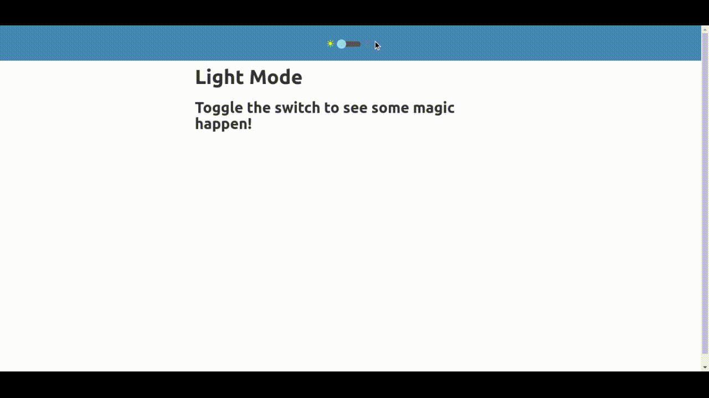

# react-dark-mode

A fully functional **Dark Mode toggle**.

Features:
- For a new user, it apply Color according to user's default preference
- Saves the preference in localStorage. When user revisits, they get their previous mode.
- Smooth transitions

To be added:
- More design/customizations
- Independent Component

 

> Open for suggestions and issues :)